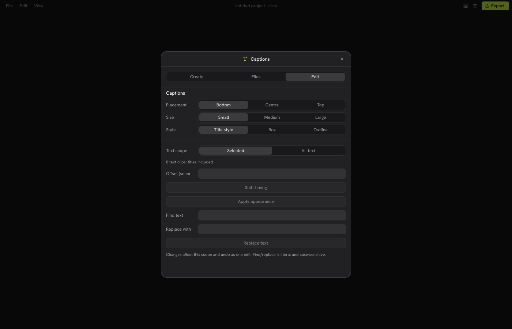

# VeyCut — وی‌کات


VeyCut is a native video editor with timeline editing, video effects, transitions, titles, captions and local speech tools. Product repository: https://github.com/alirezap73/veycut.

## Version 0.3.0 source changes

This development source adds selectable export resolutions without changing the editing project. Titles and captions are rasterized at the selected output size. Export files are isolated per job; the finished output refuses an existing file, including one created during rendering, and failed/cancelled jobs clean up their own work files. Cancelled jobs and replies from an earlier project cannot replace the current export status.

The shipping profile uses thin LTO. A build-speed improvement has not been established by a controlled comparison. The package cache now retains workspace crates under a new policy key; its first warm build and speed measurement remain pending. Windows effect tests execute the exact previously compiled test binary, keeping compilation outside the GPU-test timeout. Missing first-start effect previews use placeholders while cards are being generated. New log headers and filenames use VeyCut.

Missing-media recovery runs in a cancellable background search. Duplicate filenames are left offline, symlinks are not followed and bounded or unreadable searches make no edits. See the [English/Persian quick start](docs/QUICK-START.md).

The 0.3.0 development candidate passed native Linux/macOS/wasm checks, its Mac build and package inspection. It remains **unpublished** while the main editing path is verified for the [beta milestone](docs/BETA-READINESS.md). The public download stays at **0.2.0-preview.1**; the development version will not increase for each commit.

## Version 0.2.0 changes

- **Caption workspace:** separate Create, Files and Edit tabs, with a scrolling dialog for smaller windows.
- **Subtitle interchange:** import SRT and plain-text WebVTT; export either format from selected text clips or the whole timeline. Titles are included explicitly in the scope count.
- **Timing correction:** shift selected or all text clips by signed seconds in one undo step. Invalid times and collisions on the same track are rejected before changing anything.
- **Group appearance:** apply placement, size, boxed or outlined appearance to existing text clips, preserving each clip's font and content.
- **Find and replace:** literal, case-sensitive UTF-8 replacement over the chosen text scope, with one undo step and validation before editing.
- **Persian font:** Vazirmatn is embedded in the editor and title renderer. New Persian captions without a chosen title font use it automatically. Boxed and outlined Persian presets are included. The variable font is rendered at its default weight.
- **Quick project formats:** portrait 1080×1920 or 720×1280, square 1080×1080 and landscape 1920×1080, at 30 fps; existing custom controls remain available.
- **Reliable operations:** cancellation invalidates old subtitle/transcription replies; subtitle reads are bounded and writes are atomic. Video export validates filenames and refuses an existing output at preflight. GPU completion/readback waits have a 30-second limit.
- **Verification artifacts:** server tests exercise real Slint forms at desktop and phone sizes, bundled Persian shaping without system fonts, and a bilingual 720p/30 fps export with audio and full decoding.

## Preview and verification

The Apple silicon macOS preview is available from [GitHub Releases](https://github.com/alirezap73/veycut/releases/tag/v0.2.0-preview.1). Choose the `VeyCut-0.2.0-macos-arm64.dmg` asset. Intel Macs, Windows, Linux and mobile installers are not included in this preview.

The interface supports English and Persian. Change it in **Settings → Language**. To try the new subtitle tools, open **Captions → Files** and import an SRT or plain-text WebVTT file; **Edit** provides group timing, appearance and literal find/replace operations. Try the [bilingual subtitle examples](docs/caption-examples/TRY-CAPTIONS.txt).



The built DMG passed [package inspection on macOS 15](https://github.com/alirezap73/veycut/actions/runs/38027085464): image verification, strict signature verification, library path checks, and a 30-second startup with a native VeyCut window observed. First startup generates effect thumbnails and may log missing-thumbnail messages while they are being created.

This is an experimental preview. The macOS app is ad-hoc signed and is not Apple-notarized. Installation on a separate clean machine, native file-picker/drag-and-drop flows and long editing sessions remain unverified.

The unchanged runtime source passed **748 Linux native test cases**, macOS compilation and wasm checks. The release candidate also passed **198 development checks**. Server checks cover actual Slint form rendering and caption pointer/reopen behavior, bundled Persian font shaping, and a bilingual 720×1280/30 fps video export with audio and full decoding. See [native validation](https://github.com/alirezap73/veycut/actions/runs/38021310768) and [Mac candidate validation](https://github.com/alirezap73/veycut/actions/runs/38024725413). The baseline run includes a Windows timeout; it is not an all-platform pass. [Windows validation](https://github.com/alirezap73/veycut/actions/runs/38024989783) is tracked separately.

`manifest.json` records the package source revision, file size and checksum. `VALIDATION.json` records the native validation revision and permitted workflow/documentation differences. `PACKAGE-INSPECTION.json` records the startup check. `SHA256SUMS` covers the package and all three metadata files. See [the release checklist](FORK-RELEASE.md).

## Build and test

Rust 1.93 and the native dependencies documented in [src/README.md](src/README.md) are required. For a small local check:

```sh
cd src
cargo test --locked -j 1 -p concat-core -p concat-project -- --test-threads=1
cargo fmt --all --check
cargo clippy --locked -j 1 -p concat-project --all-targets -- -D warnings
```

Use GitHub Actions for full native validation and packaging on machines where a large local build is undesirable.

## Subtitle files

Files must be UTF-8 and at most 1 MiB. Timestamps are supported through 99:59:59,999. Cue duration must be at least 1/60 second. Overlaps and multiline text are preserved. Inline cue markup remains literal text; WebVTT export escapes it. WebVTT accepts a header, comments, cue identifiers and short/full timestamps; CSS, regions and cue layout settings are rejected explicitly. Subtitle files carry timing and text, not fonts or appearance. Export and find/replace reject blank separator lines inside a caption.

## License

AGPL-3.0-or-later. Original copyright and third-party notices are retained. See [LICENSE](LICENSE), [source notices](SOURCE-NOTICES.md), [additional permissions](LICENSE-EXCEPTIONS.md) and [trademark notices](TRADEMARK.md). Desktop bundles include the licenses for all embedded fonts.
